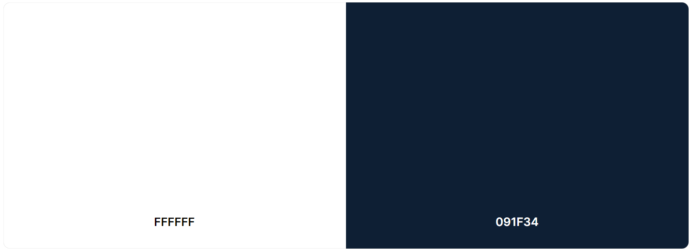
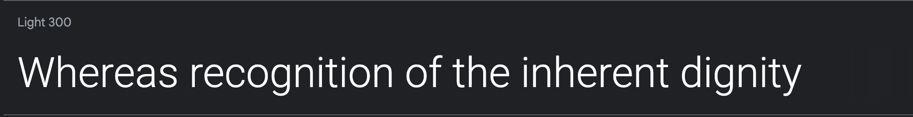

# Toons Quiz

Visit the deployed site: [Toons Quiz](https://gokwori.github.io/Toons-Quiz/)

Welcome to the Toons Quiz Game! A thrilling interactive web application designed to test your knowledge and love for the colorful world of cartoons. Whether you’re a die-hard fan of classic animations or a follower of the latest animated series, this game is crafted just for you.

Dive into a vibrant journey through various questions ranging from the golden age of cartoons to the contemporary masterpieces that have captured the hearts of millions. Our app challenges you with an array of questions that will intrigue both casual viewers and avid enthusiasts.

## CONTENTS

* [User Experience](#user-experience-ux)
  * [Project Goal](#project-goal)
  * [Trivia Enthusiast Goal](#trivia-enthusiast-goal)
  * [Casual Player Goal](#casual-player-goal)
  * [Competitive User Goal](#business-goal)
  * [Social Gamer Goal](#social-gamer-goal)
  * [Visually Impaired User Goal](#visually-impaired-user-goal)
  * [Business Goal](#business-goal)
  * [User Stories](#user-stories)
  
* [Design](#design)
  * [Colour Scheme](#colour-scheme)
  * [Typography](#typography)
  * [Imagery](#imagery)
  * [Wireframes](#wireframes)
  * [Features](#features)
    * [The Home Page](#the-home-page)
    * [The Game Page](#the-game-page)
    * [The How-To-Play Page](#the-how-to-play-page)
    * [The Settings Page](#the-settings-page)
    * [Future Implementations](#future-implementations)
  * [Accessibility](#accessibility)

* [Technologies Used](#technologies-used)
  * [Languages Used](#languages-used)
  * [Frameworks, Libraries & Programs Used](#frameworks-libraries--programs-used)

* [Deployment & Local Development](#deployment--local-development)
  * [Deployment](#deployment)
  * [Local Development](#local-development)
    * [How to Fork](#how-to-fork)
    * [How to Clone](#how-to-clone)

* [Testing](#testing)
  * [Solved Bugs](#solved-bugs)
  
* [Credits](#credits)
  * [Code Used](#code-used)
  * [Content](#content)
  * [Media](#media)
  * [Acknowledgments](#acknowledgments)

- - -

## User Experience (UX)

### Project Goal

The primary goal of the Toons Quiz Game is to create an engaging, interactive web application that offers users a fun and educational way to test their knowledge of cartoons. This project aims to deliver an immersive experience where users can interact with the site in their unique way to achieve their personal goals and find answers to their specific questions.

By leveraging HTML, CSS, and JavaScript, this app will present interactive data in a user-friendly manner, allowing for dynamic interaction and a tailored experience based on user input. The quiz will feature a variety of questions related to cartoons across different eras, challenging users of all ages and fostering a deeper appreciation and understanding of the animated world.

Through this project, I seek to not only entertain users but also to provide a platform for learning and engagement.

### Trivia Enthusiast Goal

The goal for trivia enthusiasts engaging with the Quiz Game is to provide a rich, interactive platform where they can challenge their knowledge of the cartoon universe in a fun and engaging way. This project is designed to cater to users who are passionate about cartoons, offering them an opportunity to explore a wide array of trivia questions that span across different genres, time periods, and styles of animation.

Trivia enthusiasts are encouraged to delve into the depths of their cartoon knowledge, rediscover classics, and learn about new series, all while navigating through an intuitive and responsive interface. By offering a variety of difficulty levels and question types, the game aims to keep enthusiasts engaged and motivated, pushing them to achieve higher scores and deepen their understanding of the cartoon world.

### Casual Player Goal

The objective for casual players is to offer a delightful and straightforward way to engage with cartoon-related trivia without the need for extensive knowledge or commitment. This game is designed to be accessible and enjoyable for players who seek a quick and entertaining break in their day, providing an interactive experience that can be enjoyed at their own pace.

Casual players will find the game inviting, with a focus on fun rather than competition. The game aims to offer an intuitive user experience, where getting started, selecting answers, and seeing results is seamless and immediate. With a variety of questions that cater to a broad range of cartoon knowledge, casual players can learn interesting facts and discover new cartoons, enhancing their appreciation of the genre without feeling the pressure to perform.

### Competitive User Goal

The goal for competitive users is to create a challenging and rewarding environment where they can test their mastery of cartoon trivia against themselves and others. This game is meticulously designed to cater to those who thrive on competition, offering a platform where knowledge, speed, and accuracy are key to achieving high scores and securing a place on the leaderboard.

Competitive players are provided with a series of progressively challenging questions that require not just a love for cartoons but a keen eye for detail and a deep understanding of the genre.

### Social Gamer Goal

The goal for social gamers diving into the Quiz Game is to deliver an interactive and shared gaming experience that bridges the joy of cartoon trivia with the fun of social interaction. This game is tailored to those who find the most enjoyment in playing alongside friends and family.

### Visually Impaired User Goal

The goal for visually impaired users is to ensure a fully accessible and inclusive gaming experience that allows everyone to participate fully and enjoyably. Recognizing the unique challenges faced by visually impaired users, this game is designed with accessibility at its core, enabling these users to navigate, interact, and compete on an equal footing with all other players.

### Business Goal

The primary business goal of the Toons Quiz Game is to establish a vibrant, engaging online platform that not only entertains users but also fosters a community around a shared love for cartoons. By providing an interactive and educational experience, the game aims to attract a diverse audience, from casual players to trivia enthusiasts and competitive gamers, thereby increasing user engagement and retention.

### User Stories

#### As a trivia enthusiast

* I want to access a wide range of questions about various cartoons so that I can challenge my knowledge and learn new facts.

#### As a casual player

* I want the game to be easy to play and enjoyable without requiring a lot of time or commitment so that I can have fun and relax during my free time.

#### As a competitive user

* I want to see how my scores compare to others and have the ability to achieve high scores so that I can challenge myself and others.

#### As a social gamer

* I want to share my quiz results on social media and invite friends to play so that I can enjoy the game as a social activity and connect with others who have similar interests.

#### As a visually impaired user

* I need the game to be accessible with screen readers and have keyboard navigability so that I can fully participate and enjoy the quiz without any barriers.

#### As the game developer

* I want to attract a broad user base and keep them engaged so that the site can grow in popularity and explore potential monetization opportunities.
* I aim to build a community around the game, encouraging users to return and share the game with others to increase user retention and engagement.
* I need to ensure the game is accessible to all users, including those with visual impairments, to adhere to inclusivity standards and expand the game's reach.

- - -

## Design Choices

### Colour Scheme

In the design of the Quiz game website, I've intentionally selected a colour scheme dominated by `#091f34` and `#fff` to complement the background image. `#091f34` and `#fff` serves as a subtle and clean backdrop, preventing the background image from overwhelming users. Meanwhile, the `#091f34` adds sophistication and contrast, contributing to an aesthetically pleasing and balanced visual experience. This careful integration of colors ensures that the background image enhances the overall design without overpowering or distracting users, creating a harmonious and engaging atmosphere on the website.

* I have used `#091f34` & `#fff` as the primary and secondary colours used for the sites text.

### Typography

Google Fonts was used to import the chosen fonts for use in the site.

* Primary Font: [Comic Neue](https://fonts.google.com/specimen/Comic+Neue?query=comic) - As a modern and cleaner twist on the classic comic book font, Comic Neue brings a playful yet readable style to our game's interface, perfect for the cartoon trivia theme.

* Secondary Font: [Roboto](https://fonts.google.com/specimen/Roboto?query=roboto) - For detailed explanations, feedback, and any informational text, we use Roboto. Its high readability and versatile weights make it an excellent complement to our primary font, ensuring that all users can comfortably read game content.

### Imagery

The Toons Quiz Game is rich in vibrant and captivating imagery, carefully chosen to complement the trivia questions and immerse players in the world of cartoons.

### Wireframes

Toons Quiz Game's development process began with the creation of detailed wireframes using Balsamiq wireframes. These wireframes served as blueprints for the game's design, ensuring a user-friendly interface and a seamless experience across various screens.

### Features

The Toons Quiz Game is designed with the following features to create an engaging, informative, and user-friendly experience for all types of players: ########

### Accessibility

In developing the Quiz Game, my priority is to ensure that every player, regardless of ability, can fully participate in the fun and challenge of cartoon trivia. Accessibility isn't just a feature—it's a foundational aspect of the game's design and development.

I have also been mindful during coding to ensure that the website is as accessible friendly as possible. This has been have achieved by:

* Using semantic HTML.
* Optimising the website's design to be responsive and accessible on various devices, including desktops, tablets, and phones.
* Maintaining a clear and intuitive navigation structure.
* Ensuring that users can easily navigate through the website using both keyboard and mouse.
* Implementing accessible forms with proper labels, instructions, and error messages.
* Choosing readable font styles and sizes, allowing users to adjust text as needed.
* Ensuring there is sufficient color contrast between text and background.
* Providiing descriptive alternative text for all images to assist users with visual impairments.
* Using concise and meaningful descriptions.

- - -

## Technologies Used

The development of Toons Quiz Game leverages a combination of modern web technologies and software tools to ensure a robust, interactive, and user-friendly experience. Here’s a brief overview of the key technologies and tools employed in the game’s creation:

### Languages Used

|  |  |
| -- | --|
|  | The backbone of our game, used to structure the content and layout of the web pages.|
|  | Empowers the visual design of our game, including layouts, colors, and fonts, ensuring an engaging and responsive interface.|
|  | The driving force behind the game's interactivity, enabling dynamic content manipulation, real-time feedback, and seamless user interactions.|
| | |

### Frameworks, Libraries & Programs Used

* [Adobe Express](https://new.express.adobe.com/tools/convert-to-gif) - Used to remove background from logo image

* [Am I Responsive?](http://ami.responsivedesign.is/) - To show the website image on a range of devices.

* [Balsamiq](https://balsamiq.com/) - Used to create wireframes.

* [Birme](https://www.birme.net/) - To resize images and convert to webp format.

* [Favicon.io](https://favicon.io/) - To create favicon.

* [Git](https://git-scm.com/) - For version control.

* [Github](https://github.com/) - To save and store the files for the website.

* [Google Fonts](https://fonts.google.com/) - To import the fonts used on the website.

* [Google Developer Tools](https://developers.google.com/web/tools) - To troubleshoot and test features, solve issues with responsiveness and styling.

* [jQuery](https://jquery.com/) - A JavaScript library.

* [Shields.io](https://shields.io/) To add badges to the README

* [TinyPNG](https://tinypng.com/) - To compress images

* [VS Code](https://code.visualstudio.com/) - IDE used to create the site.

* [Webpage Spell-Check](https://chrome.google.com/webstore/detail/webpage-spell-check/mgdhaoimpabdhmacaclbbjddhngchjik/related) - a google chrome extension that allows you to spell check your webpage. Used to check the site and the readme for spelling errors.

- - -

## Deployment & Local Development

### Deployment

The site is deployed using GitHub Pages - [Toons Quiz](https://gokwori.github.io/CN-Toons-Quiz/).

To Deploy the site using GitHub Pages:

1. Login (or signup) to Github.
2. Go to the repository for this project, [Toons Quiz](https://gokwori.github.io/CN-Toons-Quiz/).
3. Click the settings button.
4. Select pages in the left hand navigation menu.
5. From the source dropdown select main branch and "/(root)", then press save.
6. The site has now been deployed, please note that this process may take a few minutes before the site goes live.

### Local Development

#### How to Fork

To fork the repository:

1. Log in (or sign up) to Github.
2. Go to the repository for this project, [Toons Quiz](https://gokwori.github.io/CN-Toons-Quiz/)
3. Click the Fork button in the top right corner.

#### How to Clone

To clone the repository:

1. Log in (or sign up) to GitHub.
2. Go to the repository for this project, [Toons Quiz](https://gokwori.github.io/CN-Toons-Quiz/)
3. Click on the code button, select whether you would like to clone with HTTPS, SSH or GitHub CLI and copy the link shown.
4. Open the terminal in your code editor and change the current working directory to the location you want to use for the cloned directory.
5. Type 'git clone' into the terminal and then paste the link you copied in step 3. Press enter.

- - -

## Testing

Please refer to [Testing.md](testing.md) file for all testing carried out.

### Solved Bugs

| No | Bug | Description | Solution Applied | 
| --- | --- | --- | --- | 
| 1 |  | |  |
| 2 |  | |  |
| 3 |  | |  |
| 4 |  | |  |
| 5 |  | |  |
| 6 |  | |  |
| 7 |  | |  |
| 8 |  | |  |
| 9 |  | |  |
| 10 |  | |  |

- - -

## Credits

### Code Used
| No | Component | Comment | Source | Code Snippet | 
| --- | --- | --- | --- | --- |
| 1 |   |   | [#](#) |  |
| 2 |   |   | [#](#) |  |
| 3 |   |   | [#](#) |  |
| 4 |   |   | [#](#) |  |
| 5 |   |   | [#](#) |  |
| 6 |   |   | [#](#) |  |
| 7 |   |   | [#](#) |  |
| 8 |   |   | [#](#) |  |
| 9 |   |   | [#](#) |  |
| 10 |   |   | [#](#) |  |

### Content
| No | Content | Remark | Source | Screenshot |
| --- | --- | --- | --- | --- |
| 1 |    |   | [#](#)| |
| 2 |    |   | [#](#)| |
| 3 |    |   | [#](#)| |
| 4 |    |   | [#](#)| |
| 5 |    |   | [#](#)| |
| 6 |    |   | [#](#)| |
| 7 |    |   | [#](#)| |
| 8 |    |   | [#](#)| |
| 9 |    |   | [#](#)| |
| 10 |    |   | [#](#)| |

### Acknowledgments

I would like to acknowledge:

* Jubril Akolade - My Code Institute Mentor for his guidance and encouragement.