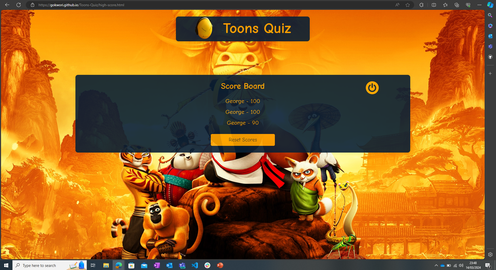
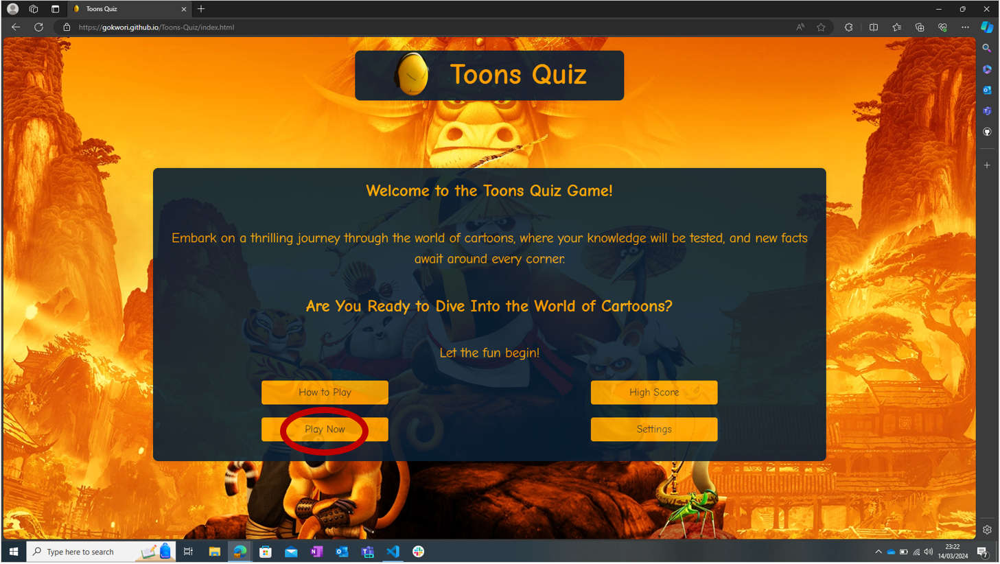
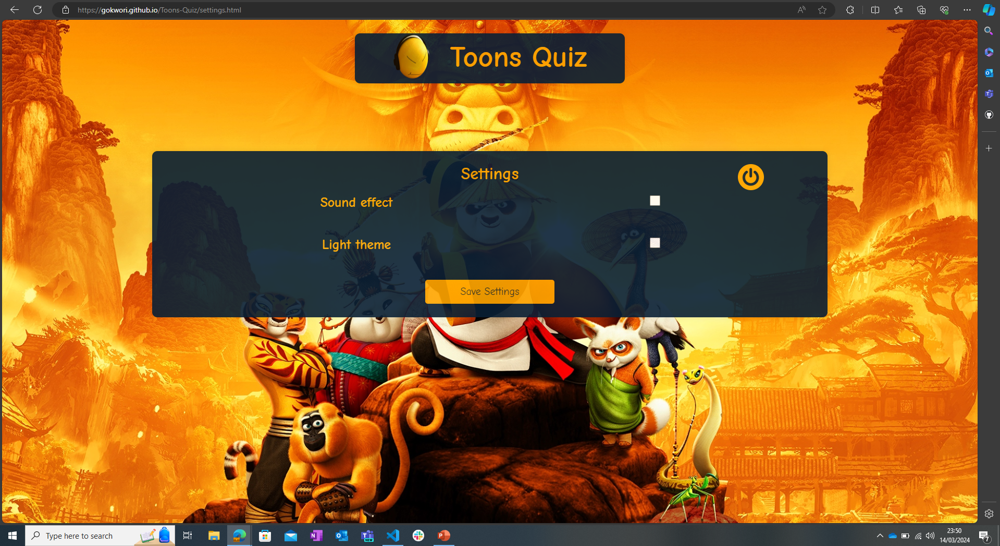
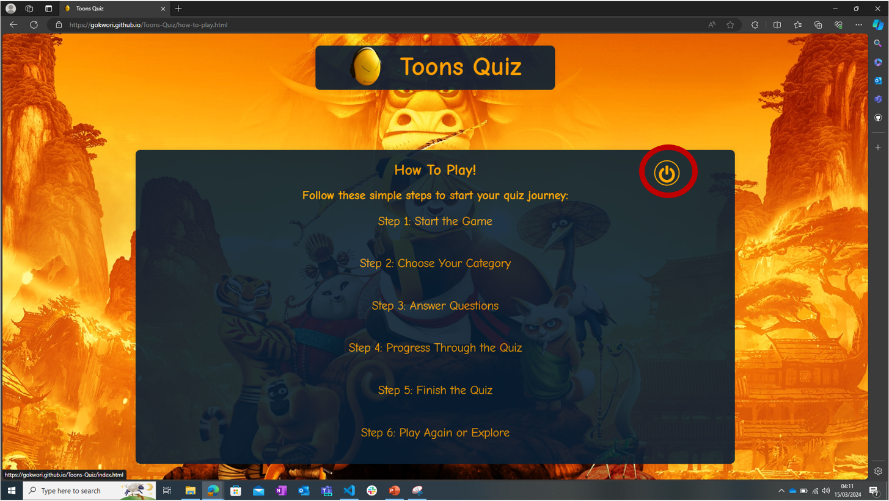

# Toons Quiz -  Testing 

Visit the deployed site: [Grizk Art Gallery](https://gokwori.github.io/Toons-Quiz/)

- - -

## CONTENTS

* [Feature Testing](#feature-testing)
* [User Story Testing](#user-story-testing)
* [Browser Compatibility](#browser-compatibility)
* [Responsiveness Testing](#responsiveness-testing)
* [Code Validation](#code-validation)
* [Lighthouse](#lighthouse)

Testing occurred continuously throughout the entire development process. I employed Chrome Developer Tools extensively during the build to identify and resolve issues promptly.

Throughout the development phase, I incorporated Google Developer Tools to verify the proper functioning of elements and to aid in diagnosing problems when they arose.

The console within the developer tools was instrumental in dissecting and validating multiple sections of JavaScript code. It served not only to confirm the functionality of the code but also to troubleshoot any encountered issues.

To guarantee responsiveness across diverse screen sizes and devices, I meticulously reviewed each page using both Google Chrome Developer Tools and the Microsoft Edge Inspector tool.

- - -

## Feature Testing

I tested each feature of my website to make sure that user interactions, forms, navigation, and any implemented functionalities work seamlessly. This involves checking the accuracy, reliability, and user-friendliness of each feature.

| Test Suite | Description | Functionality | Test Steps | Expected Result | Actual Result | Status | Snapshot |
|------------|-------------|---------------|------------|-----------------|---------------|--------|----------|
| `Home Page` | Verify the title bar functionality | Title Bar | Load the game   Click on the title bar | The home page refreshes/reloads | The home page refreshes/reloads | Pass |  |
|  | Verify the How to Play button functionality | How to Play Button | Load the game   Click on How to Play button | The buttton directs to the correct page | The buttton directs to the correct page | Pass |    |
|  | Verify the High Score button functionality | High Score Button | Load the game   Click on High Score button | The buttton directs to the correct page | The buttton directs to the correct page | Pass |     |
|  | Verify the Play Now button functionality | Play Now Button | Load the game   Click on Play Now button | The buttton directs to the correct page | The buttton directs to the correct page | Pass |     |
|  | Verify the Settings button functionality | Settings Button | Load the game   Click on Settings button | The buttton directs to the correct page | The buttton directs to the correct page | Pass |     |
|  | Verify the hover effect functionality | Title Bar | Load the game   Hover the mouse on the title bar | The title bar hovers | The title bar hovers | Pass |     |
|  | | How to Play Button | Load the game   Hover the mouse on the How to Play button | The buttton hovers and transforms into a trasparent button  | The buttton hovers and transforms into a trasparent button  | Pass |    |
|  |  | High Score Button | Load the game   Hover the mouse on the High Score button | The buttton hovers and transforms into a trasparent button  | The buttton hovers and transforms into a trasparent button | Pass |     |
|  |  | Play Now Button | Load the game   Hover the mouse on the Play Now button | The buttton hovers and transforms into a trasparent button | The buttton hovers and transforms into a trasparent button | Pass |     |
|  |  | Settings Button | Load the game   Hover the mouse on the Settings button | The buttton hovers | The buttton hovers and transforms into a trasparent button| Pass |    ) |
| `How to play` | Verify the title bar functionality | Title Bar | Load the game   Click on the title bar | Redirected to the home page | Redirected to the home page | Pass |     |
|  | Verify the Power button functionality | Power Button | Load the game   Navigate to the How to play Section   Click the Power button | Redirected to the home page | Redirected to the home page | Pass |    |
|  | Verify the hover effect functionality | Title Bar | Load the game   Navigate to the How to Play section   Hover the mouse on the title bar | The title bar hovers | The title bar hovers | Pass |     |
|  | | Power Button | Load the game   Navigate to the How to Play page   Hover the mouse on the Power button | The buttton hovers and transforms into a trasparent button  | The buttton hovers and transforms into a trasparent button  | Pass |    |
