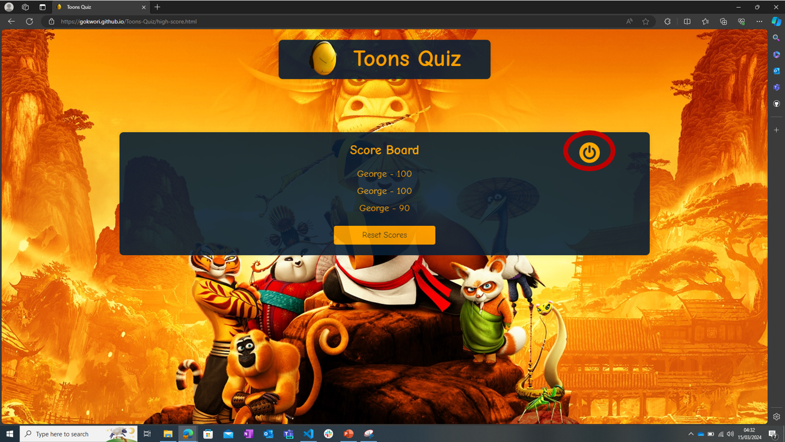
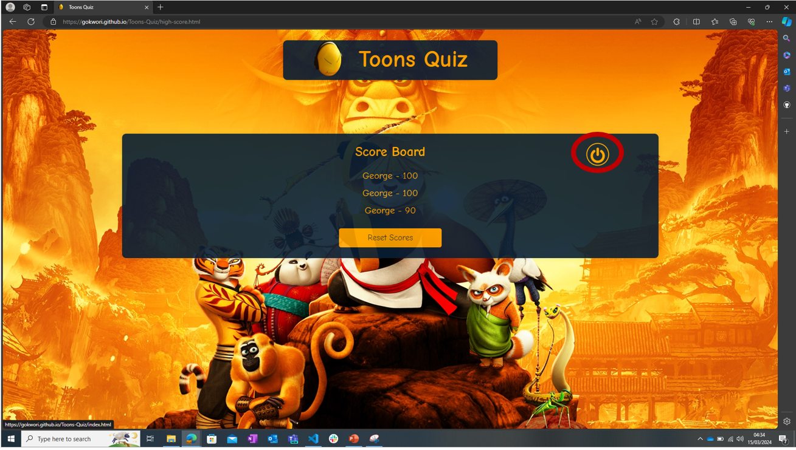

# Toons Quiz -  Testing 

Visit the deployed site: [Grizk Art Gallery](https://gokwori.github.io/Toons-Quiz/)

- - -

## CONTENTS

* [Feature Testing](#feature-testing)
* [User Story Testing](#user-story-testing)
* [Browser Compatibility](#browser-compatibility)
* [Responsiveness Testing](#responsiveness-testing)
* [Code Validation](#code-validation)
* [Lighthouse](#lighthouse)

Testing occurred continuously throughout the entire development process. I employed Chrome Developer Tools extensively during the build to identify and resolve issues promptly.

Throughout the development phase, I incorporated Google Developer Tools to verify the proper functioning of elements and to aid in diagnosing problems when they arose.

The console within the developer tools was instrumental in dissecting and validating multiple sections of JavaScript code. It served not only to confirm the functionality of the code but also to troubleshoot any encountered issues.

To guarantee responsiveness across diverse screen sizes and devices, I meticulously reviewed each page using both Google Chrome Developer Tools and the Microsoft Edge Inspector tool.

- - -

## Feature Testing

I tested each feature of my website to make sure that user interactions, forms, navigation, and any implemented functionalities work seamlessly. This involves checking the accuracy, reliability, and user-friendliness of each feature.

### `Home Page`

| **Description** | **Functionality** | **Test Steps** | **Expected Result** | **Actual Result** | **Status** | **Snapshot** |
|-------------|---------------|------------|-----------------|---------------|--------|----------|
| Verify the title bar functionality | Title Bar | Load the game   Click on the title bar | The home page refreshes/reloads | The home page refreshes/reloads | Pass |  |
| Verify the How to Play button functionality | How to Play Button | Load the game   Click on How to Play button | The buttton directs to the correct page | The buttton directs to the correct page | Pass |    |
| Verify the High Score button functionality | High Score Button | Load the game   Click on High Score button | The buttton directs to the correct page | The buttton directs to the correct page | Pass |     |
| Verify the Play Now button functionality | Play Now Button | Load the game   Click on Play Now button | The buttton directs to the correct page | The buttton directs to the correct page | Pass |     |
| Verify the Settings button functionality | Settings Button | Load the game   Click on Settings button | The buttton directs to the correct page | The buttton directs to the correct page | Pass |     |
| Verify the hover effect functionality | Title Bar | Load the game   Hover the mouse on the title bar | The title bar hovers | The title bar hovers | Pass |     |
| | How to Play Button | Load the game   Hover the mouse on the How to Play button | The buttton hovers and transforms into a trasparent button  | The buttton hovers and transforms into a trasparent button  | Pass |    |
|  | High Score Button | Load the game   Hover the mouse on the High Score button | The buttton hovers and transforms into a trasparent button  | The buttton hovers and transforms into a trasparent button | Pass |     |
|  | Play Now Button | Load the game   Hover the mouse on the Play Now button | The buttton hovers and transforms into a trasparent button | The buttton hovers and transforms into a trasparent button | Pass |     |
|  | Settings Button | Load the game   Hover the mouse on the Settings button | The buttton hovers | The buttton hovers and transforms into a trasparent button| Pass |    ) |

### `How To Play Page`

| **Description** | **Functionality** | **Test Steps** | **Expected Result** | **Actual Result** | **Status** | **Snapshot** |
|-------------|---------------|------------|-----------------|---------------|--------|----------|
| Verify the title bar functionality | Title Bar | Load the game   Navigate to the How to Play page   Click on the title bar | Redirected to the home page | Redirected to the home page | Pass |     |
| Verify the Power button functionality | Power Button | Load the game   Navigate to the How to play Section   Click the Power button | Redirected to the home page | Redirected to the home page | Pass |    |
| Verify the hover effect functionality | Title Bar | Load the game   Navigate to the How to Play section   Hover the mouse on the title bar | The title bar hovers | The title bar hovers | Pass |     |
| | Power Button | Load the game   Navigate to the How to Play page   Hover the mouse on the Power button | The buttton hovers and transforms into a trasparent button  | The buttton hovers and transforms into a trasparent button  | Pass |    |

### `High Score Page`

| **Description** | **Functionality** | **Test Steps** | **Expected Result** | **Actual Result** | **Status** | **Snapshot** |
|-------------|---------------|------------|-----------------|---------------|--------|----------|
| Verify the title bar functionality | Title Bar | Navigate to the high score page   Click on the title bar | Redirected to the home page | Redirected to the home page | Pass |     |
| Verify the Power button functionality | Power Button | Load the game   Navigate to the High Score Page   Click the Power button | Redirected to the home page | Redirected to the home page | Pass |    |
| Verify the Reset Score button functionality | Reset Score Button | Load the game   Navigate to the High Score Page   Click the Reset button   Navigate to the prompt to clear Score   Click Ok | Clears High Score | Cleared High Score | Pass |         |
| Verify the hover effect functionality | Title Bar | Load the game   Navigate to the High Score Page   Hover the mouse on the title bar | The title bar hovers | The title bar hovers | Pass |     |
| | Power Button | Load the game   Navigate to the High Score page   Hover the mouse on the Power button | The buttton hovers and transforms into a trasparent button  | The buttton hovers and transforms into a trasparent button  | Pass |    |
| | Reset Button | Load the game   Navigate to the High Score page   Hover the mouse on the Reset button | The buttton hovers and transforms into a trasparent button  | The buttton hovers and transforms into a trasparent button  | Pass |    |

### `Difficulty Level Page`

| **Description** | **Functionality** | **Test Steps** | **Expected Result** | **Actual Result** | **Status** | **Snapshot** |
|-------------|---------------|------------|-----------------|---------------|--------|----------|
| Verify the title bar functionality | Title Bar | Navigate to the Difficulty Level Page   Click on the title bar | Redirected to the home page | Redirected to the home page | Pass |  |
| Verify the Power button functionality | Power Button | Load the game   Navigate to the Difficulty Level Page   Click the Power button | Redirected to the home page | Redirected to the home page | Pass |  |
| Verify difficulty selection functionality | Difficulty Buttons | Load the game   Navigate to the Difficulty Level Page   Select a difficulty level (Easy, Medium, Hard) | Redirected to the game page with selected difficulty | Redirected to the game page with selected difficulty | Pass |  |
| Verify the hover effect functionality on difficulty buttons | Difficulty Buttons | Load the game   Navigate to the Difficulty Level Page   Hover the mouse on each difficulty button (Easy, Medium, Hard) | The button hovers and transforms into a transparent button | The button hovers and transforms into a transparent button | Pass |  |

### `Game Page`

| **Description** | **Functionality** | **Test Steps** | **Expected Result** | **Actual Result** | **Status** | **Snapshot** |
|-------------|---------------|------------|-----------------|---------------|--------|----------|
| Verify the title bar functionality | Title Bar | Navigate to the Game Page   Click on the title bar | Redirected to the home page | Redirected to the home page | Pass |  |
| Verify the Power button functionality | Power Button | Load the game   Navigate to the Game Page   Click the Power button | Redirected to the exit game page | Redirected to the exit game page | Pass |  |
| Verify question display | Question Display | Start the game   Observe the question area | A new question is displayed with multiple-choice answers | A new question is displayed with multiple-choice answers | Pass |  |
| Verify answer selection and feedback | Answer Selection | Choose an answer   Observe feedback | Correct answers turn green, incorrect answers turn red | Correct answers turn green, incorrect answers turn red | Pass |  |
| Verify the Next button functionality | Next Button | Select an answer   Click the Next button | Displays the next question | Displays the next question | Pass |  |
| Verify score update | Score Update | Correctly answer a question | Score increments according to the correct answer | Score increments according to the correct answer | Pass |  |
| Verify progress bar update | Progress Bar | Answer a question | Progress bar fills according to the number of questions answered | Progress bar fills according to the number of questions answered | Pass |  |
| Verify game completion redirects to End Game Page | Game Completion | Complete all questions   Observe redirection | Redirected to the End Game Page | Redirected to the End Game Page | Pass |  |
| Verify question option hover effect | Option Hover | Hover the mouse over question options | Options change appearance or highlights | Options change appearance or highlights | Pass |  |
| Verify the Next button hover effect | Next Button Hover | Hover the mouse over the Next button | Next button changes appearance or highlights | Next button changes appearance or highlights | Pass |  |

### `End Game Page`

| **Description** | **Functionality** | **Test Steps** | **Expected Result** | **Actual Result** | **Status** | **Snapshot** |
|-------------|---------------|------------|-----------------|---------------|--------|----------|
| Verify final score display | Final Score Display | Navigate to the End Game Page after completing a quiz | Displays the final score achieved in the quiz | Displays the final score achieved in the quiz | Pass |  |
| Verify username input functionality | Username Input | Enter a username in the input field | Enables the Save Score button upon entering a username | Enables the Save Score button upon entering a username | Pass |  |
| Verify Save Score button functionality | Save Score Button | Enter a username and click the Save Score button | Saves the score with the username | Saves the score with the username | Pass |  |
| Verify Play Again button functionality | Play Again Button | Click the Play Again button | Redirects to the difficulty level selection page to start a new game | Redirects to the difficulty level selection page to start a new game | Pass |  |
| Verify title bar functionality | Title Bar | Click on the title bar | Redirected to the home page | Redirected to the home page | Pass |  |
| Verify the Power button functionality | Power Button | Click the Power button | Redirected to the home page | Redirected to the home page | Pass |  |
| Verify Play Again button hover effect | Restart Button Hover | Hover the mouse over the Play Again button | Play Again button changes appearance or highlights | Play Again button changes appearance or highlights | Pass |  |
| Verify Save button hover effect | Restart Button Hover | Hover the mouse over the Save button | Save button changes appearance or highlights | Save button changes appearance or highlights | Pass |  |
| Verify Power button hover effect | Restart Button Hover | Hover the mouse over the Power button | Power button changes appearance or highlights | Power button changes appearance or highlights | Pass |  |
| Verify the title bar hover effect | Title Bar Hover | Hover the mouse over the title bar | Title bar changes appearance or highlights | Title bar changes appearance or highlights | Pass |  |

### `Exit Game Page`

| **Description** | **Functionality** | **Test Steps** | **Expected Result** | **Actual Result** | **Status** | **Snapshot** |
|-------------|---------------|------------|-----------------|---------------|--------|----------|
| Verify the display of the exit confirmation message | Exit Confirmation | Navigate to the Exit Game Page | Displays a confirmation message asking if the user wants to exit | Displays a confirmation message asking if the user wants to exit | Pass |  |
| Verify the "Yes" button functionality | "Yes" Button | Click the "Yes" button on the Exit Game Page | Redirects to the Home Page, effectively exiting the game | Redirects to the Home Page, effectively exiting the game | Pass |  |
| Verify the "No" button functionality | "No" Button | Click the "No" button on the Exit Game Page | Returns the user to the game or the last page they were on before the exit prompt | Returns the user to the game or the last page they were on before the exit prompt | Pass |  |
| Verify title bar functionality | Title Bar | Click on the title bar from the Exit Game Page | Redirected to the home page | Redirected to the home page | Pass |  |
| Verify "Yes" button hover effect | "Yes" Button Hover | Hover the mouse over the "Yes" button | "Yes" button changes appearance or highlights | "Yes" button changes appearance or highlights | Pass |  |
| Verify "No" button hover effect | "No" Button Hover | Hover the mouse over the "No" button | "No" button changes appearance or highlights | "No" button changes appearance or highlights | Pass |  |

### `Settings Page`

| **Description** | **Functionality** | **Test Steps** | **Expected Result** | **Actual Result** | **Status** | **Snapshot** |
|-------------|---------------|------------|-----------------|---------------|--------|----------|
| Verify sound checkbox functionality | Sound Checkbox         | Navigate to the Settings Page   Toggle the sound checkbox | Background music starts or stops based on toggle | Background music starts or stops based on toggle | Pass       |  |
| Verify theme checkbox functionality | Theme Checkbox         | Navigate to the Settings Page   Toggle the theme checkbox | Page theme switches between light and dark mode  | Page theme switches between light and dark mode  | Pass       |  |
| Verify title bar hover effect       | Title Bar Hover        | Hover the mouse over the title bar                        | Title bar changes appearance or highlights        | Title bar changes appearance or highlights        | Pass       |  |
| Verify Power button functionality   | Power Button           | Click the Power button                                    | Redirected to the home page                         | Redirected to the home page                         | Pass       |  |
| Verify Power button hover effect    | Power Button Hover     | Hover the mouse over the Power button     | Power button changes appearance or highlights     | Power button changes appearance or highlights     | Pass       |  |

## User Story Testing

I validated that my website meets the needs and expectations of different user groups. I tested scenarios based on user stories to ensure that the features align with the goals and requirements of first-time visitors, returning visitors, frequent users, art lovers, artists, and general users.

`Art Lovers`

| Goals | How are they achieved? |
| :--- | :--- |
| I want to easily access information about the gallery's objectives and mission. | To ensure easy access to comprehensive information about the gallery's objectives and mission, a dedicated "About Us" section is implemented on the website. This section serves as a central hub where art lovers can navigate to gain insights into the gallery's overarching goals and mission. | 
I want a user-friendly platform to discover and preview the latest artwork releases. | Creating a user-friendly platform for art enthusiasts to discover and preview the latest artwork releases involves the implementation of features designed to showcase these artworks prominently. The website incorporates a dedicated "New Releases" section, providing a curated space where visitors can explore and engage with the gallery's most recent additions. |
| I want to stay informed about upcoming exhibitions and events hosted by the gallery. | To ensure art lovers stay informed about upcoming exhibitions and events, the website incorporates a dedicated section that serves as a comprehensive source of information. This section may include a dynamic calendar highlighting key dates, detailed announcements about upcoming exhibitions, and a feature for newsletter subscription (which would be included in future implementations). |
| I want the ability to explore the full art catalog and conveniently purchase paintings. | The website provides a robust and user-friendly online catalog, allowing art enthusiasts to explore the complete collection. The catalog is organized in a structured manner, featuring categories, genres, and artists. |

`Artists`

|  Goals | How are they achieved? |
| :--- | :--- |
| I want a simplified and expedited process for booking exhibitions at the gallery. | The website streamlines the exhibition booking process for artists, ensuring a simplified and expedited experience. The user interface is designed with a focus on efficiency and clarity. Artists can navigate to the dedicated "Booking" section, where a user-friendly form allows them to submit essential details for exhibition consideration. |
| I want clear information about the gallery's availability for exhibitions and submission guidelines. | Comprehensive information about the gallery's availability for exhibitions and detailed submission guidelines are easily accessible on the website. A dedicated page outlines the submission process, exhibition criteria, and any specific requirements for artists. |

`General Users`

| Goals | How are they achieved? |
| :--- | :--- |
| I want a visually appealing and intuitive interface that is easy to navigate. | The website boasts a visually appealing and intuitive interface designed to enhance user experience. A clean and modern design aesthetic is implemented, ensuring that the layout is visually engaging and easy to navigate. |
| I want the website to load quickly and efficiently to access information without delays. | To meet the user's expectation of quick and efficient loading, the website is optimized for performance. Images and multimedia content are compressed without compromising quality, and the underlying code is streamlined to reduce unnecessary delays. |
| I want the website to be responsive and provide a seamless experience on various devices. | The website prioritizes a responsive design, guaranteeing a seamless experience across various devices. Whether accessed from a desktop, laptop, tablet, or smartphone, the website adapts to different screen sizes and resolutions. The responsive design is achieved through the use of flexible layouts and media queries, allowing content to adjust dynamically. |

- - -

## Browser Compatibility

I confirmed that my website performs consistently across various web browsers. Testing on popular browsers like Google Chrome, Safari, and Microsoft Edge was crucial to ensure a consistent and reliable user experience.

| Browser Tested | Intended Appearance | Intended Responsiveness | 
| --- | --- | --- | 
| Google Chrome | Good  | Good | 
| Safari | Good  | Good | 
| Microsoft Edge | Good  | Good | 

- - -

    Google Chrome

| Home Page |  |  |
| --- | --- | --- |
|  |  |  | 

| Gallery Page |  |  
| --- | --- | 
|  |  | 

| Exhibition Page | Booking Page |
| --- | --- | 
| |  | 

    Safari

| Home Page |  |  |
| --- | --- | --- |
|  |  |  | 

| Gallery Page |  |  
| --- | --- | 
|  |  | 

| Exhibition Page | Booking Page |
| --- | --- | 
| |  | 

    Microsoft Edge

| Home Page |  |  |
| --- | --- | --- |
|  |  |  | 

| Gallery Page |  |  
| --- | --- | 
|  |  | 

| Exhibition Page | Booking Page |
| --- | --- | 
| |  | 

- - -

## Responsiveness Testing

I evaluated how well my website adapts to different devices and screen sizes. Testing the responsiveness of my design ensured that the layout, images, and features adjust appropriately for optimal viewing on desktops, tablets, and mobile devices.

| Device Tested | Screen  | Site Response | Renders as intended |
| --- | --- | --- | --- | 
| iPhone 12 Pro | 390px * 844px  | Good | Yes |
| iPhone 14 Pro Max | 430px * 932px  | Good | Yes |
| iPad Mini | 768px * 1024px  | Good | Yes |
| iPad Air | 820px * 1180px  | Good | Yes |

- - -

    iPhone 12 Pro

| Home Page | Gallery Page | Exhibition Page  | Booking Page |
| --- | --- | --- | --- |
|  |  |  |  |

    iPhone 14 Pro Max

| Home Page | Gallery Page | Exhibition Page  | Booking Page |
| --- | --- | --- | --- |
|  |  |  |  |

   iPad Mini

| Home Page | Gallery Page | Exhibition Page  | Booking Page |
| --- | --- | --- | --- |
|  |  |  |  |

  iPad Air

| Home Page | Gallery Page | Exhibition Page  | Booking Page |
| --- | --- | --- | --- |
|  |  |  |  |

Full testing was also performed on the following devices with the same test outcome as above:

* Laptop:
  * Macbook Pro 2017 13"
  * Hp Spectre x360
  * HP EliteBook 830 G10 13.3"
  * Dell Latitude 5530 15"

* Mobile Devices:
  * iPhone 13 Pro Max
  * Samsung S10+

Each device tested the site using the following browsers:

* Google Chrome
* Safari
* Microsoft Edge

- - -

## Code Validation

I validated my website's code to ensure it adheres to industry standards and best practices. Using tools like W3C validators, I checked for HTML, CSS, and accessibility compliance to maintain a clean and error-free codebase.

[W3C](https://validator.w3.org/) was used to validate the HTML on all pages of the website. It was also used to validate the CSS.

| Page Tested | Validation Output |
| --- | --- |
| Home Page |  | 
| Gallery Page |  | 
| Exhibition Page |  | 
| Booking Page |  | 
| Thank-you Page |  | 
| Coming-soon Page |  | 
| CSS | | 

- - -

## Lighthouse

I utilised Lighthouse within Chrome Developer Tools to assess my website's performance, accessibility, best practices, and SEO. Leveraging Lighthouse reports, I optimised my website for speed, user experience, and search engine visibility.

### Desktop Results

All pages of the site are achieving a score of above 90 across the 4 categories.

| Page Tested | Validation Output |
| --- | --- |
| Home Page | | 
| Gallery Page |  | 
| Exhibition Page | | 
| Booking Page |  | 
| Thank-you Page |  | 
| Coming-soon Page |  | 

### Mobile Results

All pages of the site are achieving a score of above 90 across the 4 categories.

| Page Tested | Validation Output |
| --- | --- |
| Home Page | | 
| Gallery Page |  | 
| Exhibition Page | | 
| Booking Page |  | 
| Thank-you Page |  | 
| Coming-soon Page |  | 

  
- - -